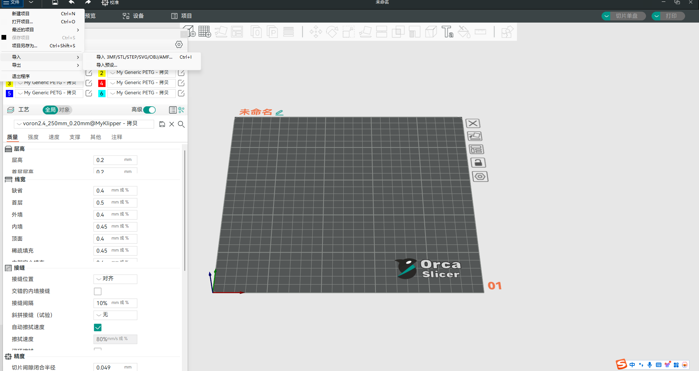

# 3D打印机操控软件使用教程

## 注意！！！！！！

每次使用打印机前，必须亲自去看打印机热床是否清空，确认清空后才能进行下一次工作！！！！！！！

##### 前言

战队和机器人协会/智能制造协会主要使用Ocaslicer和Bambu Studio这两款切片软件，所以本文主要介绍这两款切片软件的使用方法

### 1.Bamboo Studio切片软件

#### i.下载地址：

[软件下载 - Studio - Bambu Lab 拓竹科技](https://bambulab.cn/zh-cn/download/studio)

#### ii.使用说明

下载完成后打开软件，进入首页面（如图一），在左上角会有一个登陆按键，每一台拓竹打印机都会有一个对应的拓竹账号。在使用时可以向对应的打印机负责人请求拓竹账号和密码（智能制造协会的X1CC的账号由会长钟鹏管理）

图一

登陆完成后，点击“准备页面”（如图二），将你所需要打印的结构件拖入图中的黑色盘中，注意打印件不要超出黑色盘的范围，否则打印机无法打印

图二

#### 打印件放置：

如图三所示，将打印机放置在打印盘中后，尽量选择打印件与打印盘重合度最高的面（图三-1）。

图三

#### 如何选择放置面

先鼠标左键单击你需要调整方向的打印件，然后点击图四-1中的图标，之后会出现如图五中的选择界面，点击你需要的与打印盘中重合的面即可

图四

图五

#### 打印件强度调整：

如图六所示，点击“强度”选项

图六

在图七中找到以下三个选项，这三个选项就是调整打印件强度的选项，具体如何调整可以在B大搜索教程，也可以寻求机械组学长的帮助

图七

#### 打印件支撑

一般情况下，设计的打印件中都会有一些孔或者凹槽。要想让3D打印机打印出这些凹槽、孔，需要加上支撑

在图八中，点击“支撑选项”

图八

在图九中勾选“开启支撑”，然后在把类型选择“树状（自动）”

图九

#### 打印

当所有的设置都设置完毕后，在右上角选择”切片单盘“，也可以直接在左上角点击“预览”，软件会自动生成打印切片，确认无误后在右上角点击“打印单盘”，打印机就会开始执行工作

### Ocarslicer切片软件

#### i.下载地址（推荐挂梯子，更快）

[Orca Slicer - 3D printing slicer [Download\]](https://orcaslicer.net/#download-orca-slicer)

进入页面后点击“Download”，选择“Windows Version”下载

#### ii.使用说明

Ocarslicer不需要进行登录，可以直接使用。但是使用前提条件条件和Bambu Studio不一样，所以下文中只说明使用前提条件

##### 1.导入预设

在左上角点击“文件”，"导入"，“导入预设”，具体的预设可以向协会的学长请求

导入预设后点击图十-1，在2中输入打印机域名（也可以向学长请求）

图十

然后在连接和打印机同一个的WiFi

（P.S.如果看完本文档仍有疑惑，可以观看下属视频，这个视频讲的比较详细：https://www.bilibili.com/video/BV1HN4y187yA/?spm_id_from=333.337.search-card.all.click&vd_source=78020f6c05bc2adb014c1daad761bf5a）
